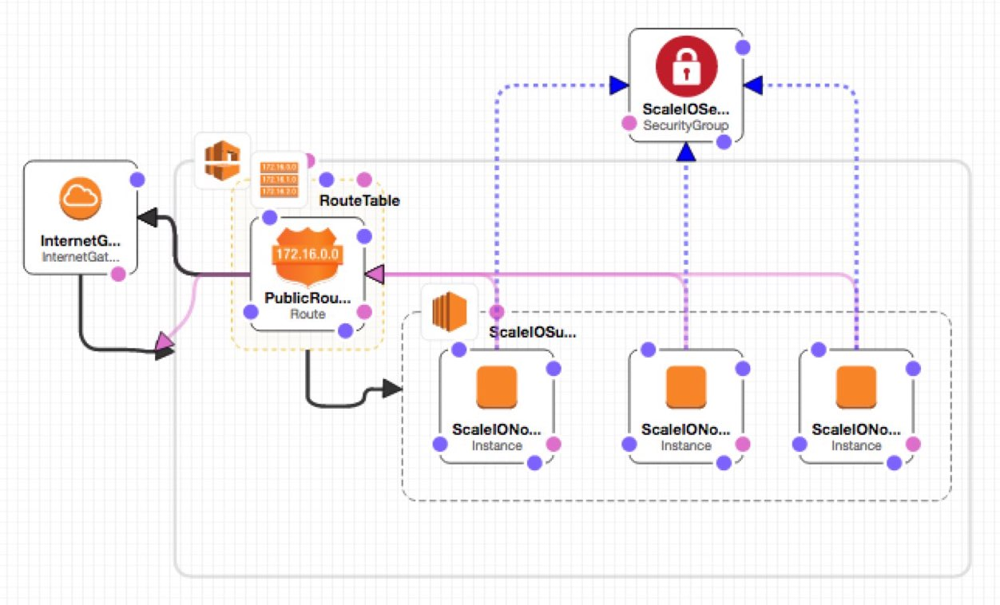

# aws-scaleio


A project to stand up a ScaleIO cluster in AWS, for testing against EMC {code} projects. This project is intended to be a component in a continuous-integration pipeline, so we can ~~stop testing against the ScaleIO cluster in Kenny's garage~~ automate testing in a more distributable fashion.

This template uses a custom AMI image that is (currently) only available in the US-West-1 (aka N.California) region. You've been warned!

##Usage

Launch this template **currently in the US-West-1 (_aka N.California_) region only** using AWS Cloudformation. 

The password for the ScaleIO admin is 'F00barbaz'. Other places a password might be used, same thing.

###AWS Web GUI

Using the AWS web gui, in the services selection window:
 - click 'Cloudformation' under 'Management Tools'
 - click 'Create Stack', then 'Choose a Template'
 - click 'Upload file to S3', and upload the .json file from this repo
 - give the stack a name (like ScaleIOTesting or something)
 - select a keypair that exists in the N.California region!
 - alter the ssh source CIDR if you like, or don't
 - click next, add tags if you want, or don't, then click next
 - review your settings and click 'Create' to create the stack

The stack will take approximately two minutes to build, and then should be available for login.

###AWS Commandline

To launch this stack using AWS commandline tools, use a commandline similar to the following:

```
[user@host] ~/ $ aws cloudformation create-stack --stack-name ScaleIOTesting \
--template-body file:////home/ME/dev/aws-scaleio/ScaleIO_Testing_Cluster.json \
--parameters ParameterKey=KeyName,ParameterValue=MYKEY
```

The stack will take approximately two minutes to build, and then should be available for login.

##Once It's Running
The script launches three AWS instances of type 't1.medium', with the internal IP addresses 10.0.0.11, 10.0.0.12 and 10.0.0.13. The ScaleIO installer was deployed on 10.0.0.11 and then used to install **ScaleIO v2.0.0-5014** onto the three nodes.

Each of the nodes has a 120Gb SSD drive attached - this drive appears as **/dev/xdvc**.

When the machines come up, there appears to be a bit of a race condition between 10.0.0.11 and 10.0.0.12 as to whom will become the MDM master, whatever that is. SSHing to on or more of the machines until you find the master, then issuing the following command:

```scli --login --username admin --password F00barbaz```

should log you into the ScaleIO MDM, then you should be able to manipulate the storage volumes.
